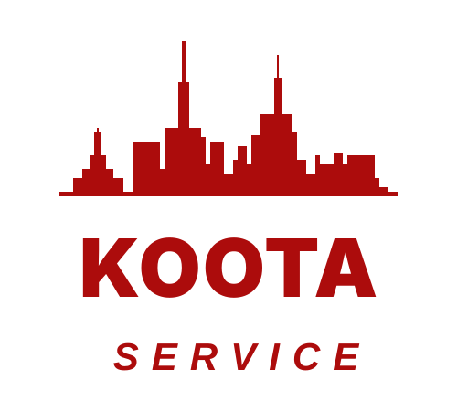

<p align="center">
  
</p>

<h1 align="center">KOOTA SERVICES</h1>

<p align="center">
  <strong>Solusi Fasilitas Terintegrasi — One-Stop Facility Services</strong>
</p>

<p align="center">
  
  
  
  
  
  
</p>

---

## 📋 Tentang Proyek

**Koota Services** adalah website company profile profesional untuk perusahaan penyedia layanan perawatan fasilitas terintegrasi yang beroperasi di **Surabaya, Malang, Bali, dan Jakarta**.

Website ini dibangun sebagai bagian dari proyek **Kerja Praktik** dan berfungsi sebagai platform informasi layanan, portofolio proyek, blog edukasi, serta sistem konsultasi online yang terhubung langsung ke WhatsApp.

### 🎯 Layanan Utama
| No | Layanan | Deskripsi |
|----|---------|-----------|
| 1 | **Cleaning Service** | Kebersihan komersial & industrial (general cleaning, deep cleaning, office cleaning) |
| 2 | **Pengangkutan Sampah** | Pengangkutan sampah terjadwal, komersial, dan pascarenovasi |
| 3 | **Jasa Tukang & Renovasi** | Perbaikan ringan, maintenance rutin, dan renovasi interior |
| 4 | **IPAL** | Instalasi Pengolahan Air Limbah, maintenance, dan uji laboratorium |

---

## 🛠️ Tech Stack

### Frontend
| Teknologi | Versi | Kegunaan |
|-----------|-------|----------|
| **TailwindCSS** | 4.x | Utility-first CSS framework untuk styling responsif |
| **Alpine.js** | 3.x | Reactive JavaScript framework ringan untuk interaktivitas UI |
| **Vite** | 6.x | Build tool & dev server untuk kompilasi asset frontend |
| **Google Fonts** | - | Typography premium (Plus Jakarta Sans, Playfair Display) |

### Backend
| Teknologi | Versi | Kegunaan |
|-----------|-------|----------|
| **PHP** | 8.2+ | Bahasa pemrograman server-side |
| **Laravel** | 12.x | Full-stack PHP framework (MVC architecture) |
| **Blade** | - | Template engine bawaan Laravel untuk rendering view |
| **Eloquent ORM** | - | Object-Relational Mapping untuk interaksi database |
| **SQLite** | 3.x | Database ringan berbasis file (tanpa instalasi server DB) |

### Tools & Libraries
| Tool | Kegunaan |
|------|----------|
| **Composer** | PHP dependency manager |
| **NPM** | Node.js package manager untuk frontend dependencies |
| **Git** | Version control system |

---

## ✨ Fitur Utama

### 🌐 Website Publik
- **Homepage** — Landing page dengan hero section, 4 layanan utama, proses alur kerja 6 langkah, FAQ accordion, dan CTA konsultasi
- **Halaman Layanan** — Katalog layanan dengan kartu 3D floating icon, dropdown mega menu
- **Detail Layanan** — Halaman detail per layanan (Cleaning, Sampah, Tukang, IPAL) dengan hero banner, solusi kartu, tab industri, dan video highlight
- **Portofolio** — Galeri foto proyek dengan filter kategori, lightbox zoom, dan katalog foto detail
- **Blog & Artikel** — Artikel edukasi dengan filter kategori dan detail halaman artikel
- **Konsultasi** — Formulir konsultasi online yang terintegrasi langsung ke WhatsApp
- **Tentang Kami** — Profil perusahaan, visi & misi, FAQ

### 🌍 Multi-Bahasa (i18n)
- **Bahasa Indonesia** 🇮🇩 dan **English** 🇺🇸
- Seluruh teks di semua halaman (termasuk FAQ, blog, portofolio, layanan) berubah secara instan saat bahasa diganti
- Language switcher dengan pill glossy dan ikon bendera negara

### 🎨 Desain Modern
- **Bubble Gloss Hover Effect** pada navigasi header (glassmorphism)
- **Slide-out Side Drawer Menu** (off-canvas menu dari kanan)
- **3D Floating Timbul Icon** pada kartu layanan
- **Dark Mode Mega Menu** untuk dropdown layanan
- Responsive design (mobile, tablet, desktop)

### 🔧 Admin Dashboard
- Login admin dengan autentikasi Laravel
- CRUD lengkap untuk: **Layanan**, **Portofolio/Proyek**, **Artikel Blog**, **FAQ**, dan **Konsultasi**
- **Maintenance Mode** — Aktifkan/nonaktifkan mode pemeliharaan dari dashboard
- Statistik ringkas jumlah layanan, proyek, artikel, dan konsultasi

---

## 📁 Struktur Proyek

```
KootaServices/
├── app/
│   ├── Helpers/              # VideoHelper (YouTube/Instagram embed parser)
│   ├── Http/
│   │   ├── Controllers/      # Public controllers (Home, Service, Blog, dll)
│   │   │   └── Admin/        # Admin controllers (Dashboard, CRUD)
│   │   └── Middleware/        # SetLocale, CheckMaintenanceMode
│   └── Models/               # Eloquent models (Service, Project, Post, Faq, dll)
├── database/
│   ├── migrations/           # Skema tabel database
│   └── seeders/              # Data awal (4 layanan, proyek, artikel, FAQ)
├── lang/
│   ├── en.json               # Kamus terjemahan Bahasa Inggris
│   └── id.json               # Kamus terjemahan Bahasa Indonesia
├── public/
│   └── images/               # Logo SVG (logo.svg, logo-icon.svg, logo-white.svg)
├── resources/
│   ├── css/app.css           # Stylesheet utama
│   ├── js/app.js             # JavaScript utama
│   └── views/
│       ├── layouts/          # Layout utama (app.blade.php, admin.blade.php)
│       ├── home.blade.php    # Homepage
│       ├── services/         # Halaman layanan (index, show)
│       ├── portfolio/        # Halaman portofolio (index, show)
│       ├── blog/             # Halaman blog (index, show)
│       ├── about.blade.php   # Halaman tentang kami
│       ├── consultation/     # Halaman konsultasi
│       ├── maintenance.blade.php  # Halaman mode pemeliharaan
│       └── admin/            # Halaman admin dashboard & CRUD
├── routes/web.php            # Definisi semua route
├── tests/                    # Script pengujian otomatis
└── .env                      # Konfigurasi environment (database, app key)
```

---

## 🚀 Instalasi & Menjalankan di Device Lain

### Prasyarat (Wajib Diinstal Terlebih Dahulu)
1. **PHP** ≥ 8.2 — [Download PHP](https://www.php.net/downloads)
2. **Composer** — [Download Composer](https://getcomposer.org/download/)
3. **Node.js** ≥ 18.x & **NPM** — [Download Node.js](https://nodejs.org/)
4. **Git** — [Download Git](https://git-scm.com/downloads)

### Langkah-Langkah Instalasi

#### 1️⃣ Clone Repository
```bash
git clone https://github.com/kootaproduction/koota-services.git
cd koota-services
```

#### 2️⃣ Install Dependencies PHP (Backend)
```bash
composer install
```

#### 3️⃣ Install Dependencies Node.js (Frontend)
```bash
npm install
```

#### 4️⃣ Konfigurasi Environment
```bash
cp .env.example .env
php artisan key:generate
```

#### 5️⃣ Buat Database SQLite
```bash
# Buat file database kosong
# Windows (PowerShell):
New-Item -Path database/database.sqlite -ItemType File

# macOS / Linux:
touch database/database.sqlite
```

Pastikan file `.env` memiliki konfigurasi database berikut:
```env
DB_CONNECTION=sqlite
DB_DATABASE=database/database.sqlite
```

#### 6️⃣ Jalankan Migrasi Database & Seeder
```bash
php artisan migrate --seed
```
> Perintah ini akan membuat semua tabel dan mengisi data awal (4 layanan, proyek, artikel blog, FAQ, serta akun admin).

#### 7️⃣ Jalankan Aplikasi (2 Terminal Terpisah)

**Terminal 1 — Backend Server (Laravel):**
```bash
php artisan serve
```
> Server berjalan di: `http://127.0.0.1:8000`

**Terminal 2 — Frontend Dev Server (Vite + TailwindCSS):**
```bash
npm run dev
```
> Vite akan mengkompilasi CSS & JS secara real-time.

#### 8️⃣ Buka di Browser
```
http://127.0.0.1:8000
```

---

## 🔐 Akses Admin Dashboard

| Field | Nilai |
|-------|-------|
| **URL** | `http://127.0.0.1:8000/admin/login` |
| **Email** | `admin@kootaservice.com` |
| **Password** | `password` |

> ⚠️ **Penting:** Ganti password default setelah login pertama kali di lingkungan produksi.

---

## 📦 Perintah Berguna

| Perintah | Keterangan |
|----------|------------|
| `php artisan serve` | Menjalankan backend server Laravel |
| `npm run dev` | Menjalankan frontend dev server (Vite) |
| `npm run build` | Build asset frontend untuk produksi |
| `php artisan migrate` | Menjalankan migrasi database |
| `php artisan migrate --seed` | Migrasi + isi data awal |
| `php artisan db:seed` | Mengisi ulang data seeder |
| `php artisan migrate:fresh --seed` | Reset database & isi ulang dari awal |
| `php artisan cache:clear` | Bersihkan cache aplikasi |
| `php artisan route:list` | Melihat daftar semua route |

---

## 🌐 Area Layanan

<p align="center">
  
  
  
  
</p>

---

## 📞 Kontak

| Channel | Info |
|---------|------|
| **WhatsApp** | [0812-1759-7109](https://wa.me/6281217597109) |
| **Email** | [kootaproduction@gmail.com](mailto:kootaproduction@gmail.com) |
| **GitHub** | [kootaproduction](https://github.com/kootaproduction) |

---

## 📄 Lisensi

Proyek ini dikembangkan untuk keperluan **Kerja Praktik**. Framework Laravel berlisensi [MIT License](https://opensource.org/licenses/MIT).

---

<p align="center">
  <strong>🏙️ "Kita Wujudkan Kota Bersih" 🏙️</strong><br>
  <sub>© 2024-2026 Koota Services. All rights reserved.</sub>
</p>
